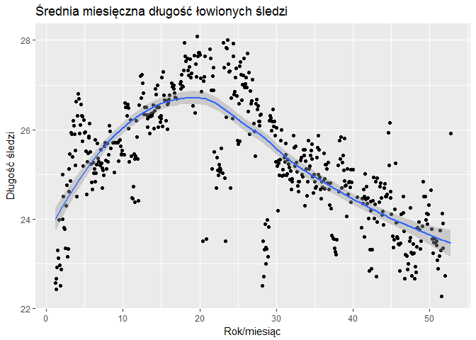
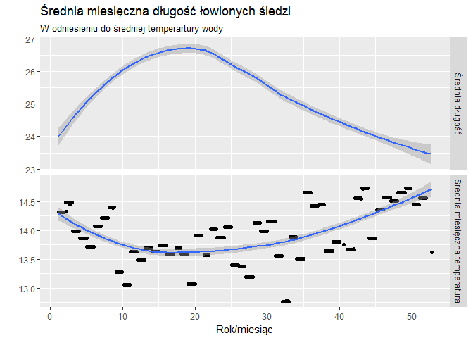
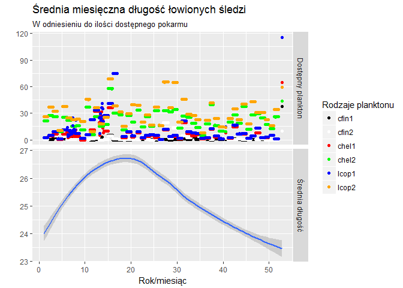
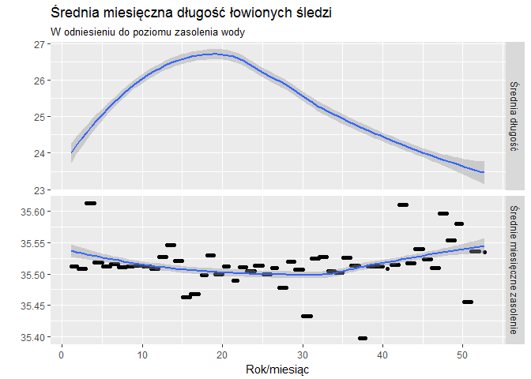
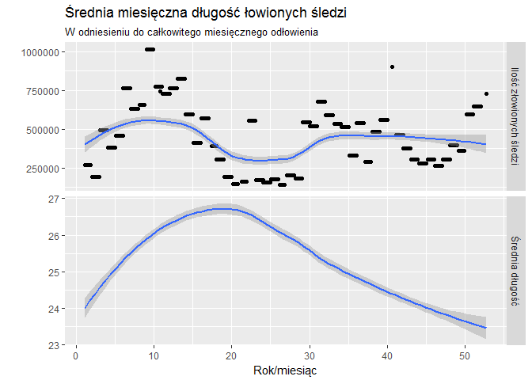
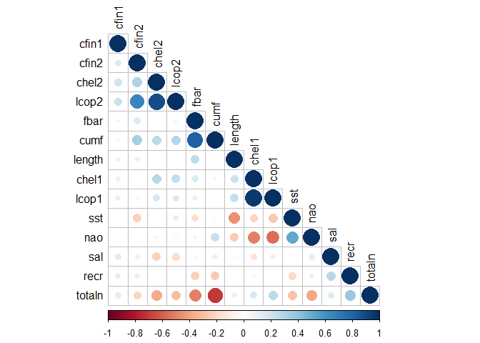
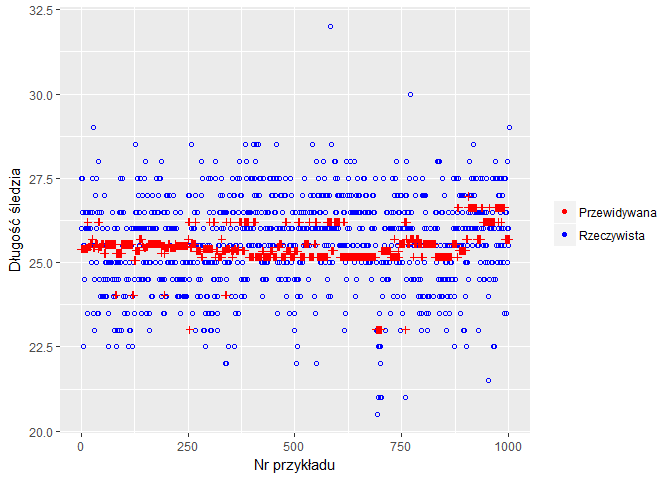
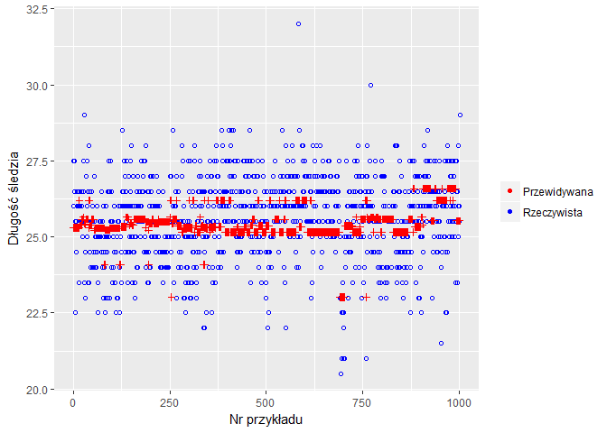

# Śledzie
Michał Mendyk  
`r format(Sys.time(), '%d %b %Y')`  

# Wstęp


```r
library(knitr)
library(dplyr)
library(ggplot2)
library(corrplot)
library(plotly)
library(caret)
```


<!--html_preserve--><div id="htmlwidget-4f14c0b2b030deb3adfc" style="width:672px;height:480px;" class="plotly html-widget"></div>
<script type="application/json" data-for="htmlwidget-4f14c0b2b030deb3adfc">{"x":{"data":[{"x":[1.16666666666667,1.25,1.33333333333333,1.41666666666667,1.5,1.58333333333333,1.66666666666667,1.75,1.83333333333333,1.91666666666667,2.08333333333333,2.16666666666667,2.25,2.33333333333333,2.41666666666667,2.5,2.58333333333333,2.66666666666667,2.75,2.83333333333333,2.91666666666667,3,3.08333333333333,3.16666666666667,3.25,3.33333333333333,3.41666666666667,3.5,3.58333333333333,3.66666666666667,3.75,3.83333333333333,3.91666666666667,4,4.08333333333333,4.16666666666667,4.25,4.33333333333333,4.41666666666667,4.5,4.58333333333333,4.66666666666667,4.75,4.83333333333333,4.91666666666667,5,5.08333333333333,5.16666666666667,5.25,5.33333333333333,5.41666666666667,5.5,5.58333333333333,5.66666666666667,5.75,5.83333333333333,5.91666666666667,6,6.08333333333333,6.16666666666667,6.25,6.33333333333333,6.41666666666667,6.5,6.58333333333333,6.66666666666667,6.75,6.83333333333333,7,7.08333333333333,7.16666666666667,7.25,7.33333333333333,7.41666666666667,7.5,7.58333333333333,7.66666666666667,7.75,7.83333333333333,7.91666666666667,8,8.16666666666667,8.25,8.33333333333333,8.41666666666667,8.66666666666667,8.75,8.83333333333333,9.08333333333333,9.33333333333333,9.41666666666667,9.5,9.58333333333333,9.66666666666667,9.75,9.83333333333333,9.91666666666667,10.1666666666667,10.25,10.3333333333333,10.5,10.5833333333333,10.6666666666667,10.75,10.8333333333333,11,11.0833333333333,11.1666666666667,11.25,11.3333333333333,11.4166666666667,11.5,11.5833333333333,11.6666666666667,11.75,11.8333333333333,11.9166666666667,12,12.0833333333333,12.25,12.3333333333333,12.5,12.5833333333333,12.6666666666667,12.75,12.8333333333333,13,13.0833333333333,13.1666666666667,13.25,13.3333333333333,13.5,13.5833333333333,13.6666666666667,13.75,13.8333333333333,13.9166666666667,14,14.0833333333333,14.25,14.3333333333333,14.4166666666667,14.5,14.5833333333333,14.6666666666667,14.75,14.8333333333333,14.9166666666667,15,15.0833333333333,15.1666666666667,15.25,15.3333333333333,15.4166666666667,15.5833333333333,15.6666666666667,15.75,15.8333333333333,15.9166666666667,16,16.0833333333333,16.3333333333333,16.4166666666667,16.5833333333333,16.6666666666667,16.75,16.8333333333333,17,17.4166666666667,17.5,17.5833333333333,17.6666666666667,17.75,17.8333333333333,17.9166666666667,18,18.0833333333333,18.1666666666667,18.3333333333333,18.5,18.5833333333333,18.6666666666667,18.75,18.8333333333333,18.9166666666667,19.0833333333333,19.3333333333333,19.4166666666667,19.5,19.5833333333333,19.6666666666667,19.75,19.8333333333333,19.9166666666667,20,20.1666666666667,20.25,20.4166666666667,20.5,20.5833333333333,20.6666666666667,20.8333333333333,21.3333333333333,21.4166666666667,21.5,21.5833333333333,21.6666666666667,21.75,21.8333333333333,21.9166666666667,22.1666666666667,22.25,22.3333333333333,22.4166666666667,22.5,22.5833333333333,22.6666666666667,22.75,22.8333333333333,23,23.0833333333333,23.1666666666667,23.25,23.3333333333333,23.4166666666667,23.5,23.5833333333333,23.6666666666667,23.75,23.8333333333333,23.9166666666667,24,24.0833333333333,24.25,24.3333333333333,24.4166666666667,24.5,24.5833333333333,24.6666666666667,24.75,24.8333333333333,24.9166666666667,25,25.0833333333333,25.1666666666667,25.25,25.3333333333333,25.4166666666667,25.5,25.5833333333333,25.6666666666667,25.75,25.8333333333333,25.9166666666667,26,26.1666666666667,26.25,26.3333333333333,26.4166666666667,26.5,26.5833333333333,26.6666666666667,26.75,26.8333333333333,27.0833333333333,27.1666666666667,27.25,27.3333333333333,27.4166666666667,27.5,27.5833333333333,27.6666666666667,27.75,27.8333333333333,27.9166666666667,28,28.1666666666667,28.25,28.3333333333333,28.4166666666667,28.5,28.5833333333333,28.6666666666667,28.75,28.8333333333333,28.9166666666667,29,29.0833333333333,29.1666666666667,29.25,29.3333333333333,29.5,29.5833333333333,29.6666666666667,29.75,29.8333333333333,29.9166666666667,30,30.0833333333333,30.1666666666667,30.25,30.3333333333333,30.4166666666667,30.5,30.5833333333333,30.6666666666667,30.75,30.8333333333333,30.9166666666667,31,31.0833333333333,31.1666666666667,31.25,31.3333333333333,31.4166666666667,31.5,31.5833333333333,31.6666666666667,31.75,31.8333333333333,31.9166666666667,32,32.0833333333333,32.25,32.3333333333333,32.4166666666667,32.5,32.5833333333333,32.6666666666667,32.75,32.8333333333333,32.9166666666667,33,33.1666666666667,33.25,33.3333333333333,33.4166666666667,33.5,33.5833333333333,33.6666666666667,33.75,33.8333333333333,33.9166666666667,34,34.0833333333333,34.1666666666667,34.25,34.3333333333333,34.4166666666667,34.5,34.5833333333333,34.6666666666667,34.75,34.8333333333333,34.9166666666667,35,35.0833333333333,35.1666666666667,35.25,35.3333333333333,35.4166666666667,35.5,35.5833333333333,35.6666666666667,35.75,35.8333333333333,35.9166666666667,36,36.0833333333333,36.1666666666667,36.25,36.3333333333333,36.4166666666667,36.5,36.5833333333333,36.6666666666667,36.75,36.8333333333333,36.9166666666667,37,37.1666666666667,37.25,37.4166666666667,37.5,37.5833333333333,37.6666666666667,37.75,37.8333333333333,38.0833333333333,38.1666666666667,38.25,38.3333333333333,38.4166666666667,38.5,38.5833333333333,38.6666666666667,38.75,38.8333333333333,38.9166666666667,39,39.0833333333333,39.1666666666667,39.25,39.3333333333333,39.4166666666667,39.5,39.5833333333333,39.6666666666667,39.75,39.8333333333333,39.9166666666667,40,40.5833333333333,41.0833333333333,41.1666666666667,41.25,41.3333333333333,41.4166666666667,41.5,41.5833333333333,41.6666666666667,41.75,41.8333333333333,41.9166666666667,42,42.0833333333333,42.1666666666667,42.25,42.3333333333333,42.4166666666667,42.5,42.5833333333333,42.6666666666667,42.75,42.8333333333333,42.9166666666667,43,43.0833333333333,43.1666666666667,43.4166666666667,43.5,43.5833333333333,43.6666666666667,43.75,43.8333333333333,43.9166666666667,44.0833333333333,44.1666666666667,44.25,44.3333333333333,44.4166666666667,44.5833333333333,44.6666666666667,44.75,44.8333333333333,44.9166666666667,45,45.1666666666667,45.25,45.3333333333333,45.4166666666667,45.5,45.5833333333333,45.6666666666667,45.75,45.8333333333333,45.9166666666667,46,46.0833333333333,46.1666666666667,46.25,46.5,46.5833333333333,46.6666666666667,46.75,46.8333333333333,47,47.0833333333333,47.1666666666667,47.3333333333333,47.4166666666667,47.5,47.5833333333333,47.6666666666667,47.75,47.8333333333333,47.9166666666667,48,48.0833333333333,48.1666666666667,48.25,48.3333333333333,48.4166666666667,48.5,48.5833333333333,48.6666666666667,48.75,48.8333333333333,49,49.1666666666667,49.25,49.4166666666667,49.5,49.5833333333333,49.6666666666667,49.75,49.8333333333333,50.1666666666667,50.25,50.3333333333333,50.4166666666667,50.5,50.5833333333333,50.6666666666667,50.75,50.8333333333333,50.9166666666667,51,51.0833333333333,51.25,51.3333333333333,51.4166666666667,51.5,51.5833333333333,51.6666666666667,51.75,52,52.75],"y":[22.5714285714286,22.6612903225806,22.4222972972973,22.9146341463415,23.2931034482759,23.1314102564103,23.9783464566929,22.9703703703704,22.5132075471698,22.8703703703704,25,24,24.5,23.8,23.7727272727273,23.3513513513514,24.2941176470588,24.7556818181818,23.15625,23.3387096774194,24.6078431372549,25.1190476190476,25.452380952381,24.8529411764706,25.9342105263158,25.9047619047619,25.3981481481481,26.1944444444444,26.0968586387435,25.90625,25.2,25.5364583333333,26.6326530612245,24.5,26.3092105263158,26.8095238095238,26.6944444444444,25.9198113207547,26.1037735849057,26.5643939393939,26.3089171974522,25.7402597402597,26.2939297124601,25.1888111888112,26.222602739726,25.9375,25.9396551724138,25.5215517241379,24.5526315789474,25.2864077669903,25.4677419354839,25.8540669856459,25.8211805555556,26.1376811594203,25.5089285714286,25.2326203208556,24.8255813953488,24.6666666666667,25.2695035460993,25.0218446601942,25.1161971830986,25.7753623188406,24.8374485596708,25.0276243093923,25.2155963302752,25.6944444444444,25.3670886075949,25.2864450127877,25.203488372093,25.5463917525773,25.2450980392157,25.1451612903226,24.6875,25.0857142857143,24.9791666666667,25.6271186440678,25.7142857142857,25.3110465116279,25.1179624664879,25.6875,25.287037037037,25.4444444444444,26.0967741935484,25.9571428571429,25.5833333333333,25.7117903930131,25.7068965517241,25.0357142857143,25.7105263157895,25.7088235294118,25.2896825396825,25.7529411764706,25.7649572649573,25.6276041666667,25.4444444444444,25.4587458745875,25.5403225806452,25.4335664335664,26.59375,26.5,26.3069306930693,26.5636363636364,26.4866666666667,26.0281690140845,25.2857142857143,26.2166666666667,25.4,24.478640776699,24.4563008130081,24.7268292682927,25.4485893416928,25.342817679558,24.3738738738739,25.4090305444887,26.1991869918699,25.8296296296296,25.34375,24.4026548672566,26.5555555555556,27.2,26.7076923076923,27.2238805970149,27.0384615384615,26.8163265306122,26.3422459893048,26.5052631578947,26.5036764705882,26.3260869565217,26.0547945205479,26.2457983193277,26.328729281768,25.9184397163121,26.2944078947368,26.3565217391304,26.3067226890756,26.3793103448276,26.5462962962963,26.0290322580645,26.4181818181818,26.9067796610169,26.7844827586207,26.5,26.9899497487437,26.0625,26.5,26.2785234899329,26.1608910891089,26.3048780487805,26.2546296296296,27.1666666666667,26.0714285714286,27.2916666666667,26.7666666666667,26.6594202898551,26.2037037037037,26.65,26.5725806451613,26.0054347826087,26.59375,26.6774193548387,26.7743902439024,27.047619047619,26.9553571428571,27,26.90625,26.8180473372781,26.7270992366412,26.6923076923077,27.02,26.9181818181818,27.0769230769231,27.2363636363636,26.9795918367347,26.953488372093,27.328125,27.9375,27.6431034482759,27.530303030303,27.5918367346939,27.3205128205128,27.2093023255814,27.4122807017544,27.5714285714286,27.1666666666667,27.2685185185185,26.5263157894737,27.6515151515152,26.38,27.4736842105263,27.1875,28.0871559633028,27.6487603305785,27.7163461538462,27.7159090909091,27.675,27.1527777777778,26.8428571428571,23.5,27.081,27.1761363636364,27.6344827586207,23.55,27.8026315789474,27.6,26.8870967741935,25.125,27.2058823529412,26.8793103448276,27.3833333333333,25.5,24.6947368421053,25.375,25.0925925925926,24.9852941176471,25.2209302325581,25.1307692307692,25.0513698630137,25.1140350877193,25.5752427184466,25.0274725274725,27.9444444444444,27.3857142857143,24.9166666666667,23.5,26.2733333333333,27.8333333333333,27.8235294117647,28.0086206896552,27.4677419354839,27.2986111111111,27.3166666666667,24.6923076923077,26.7,26.2413793103448,27.9285714285714,27.64375,26.7837837837838,26.8465909090909,27.1681034482759,27.3775510204082,26.756880733945,25.7544642857143,25.6785714285714,26.5833333333333,25.7426470588235,27.425,27.5166666666667,27.2226277372263,26.6595238095238,27.0094339622642,27.2163461538462,27.5882352941176,26.9390243902439,27.0263157894737,27.1666666666667,26.9507042253521,27.7037037037037,26.4014084507042,27.2826086956522,25.904,26.8684210526316,26.5757575757576,26.6470588235294,27.125,26.1395348837209,25.9662921348315,25.40625,26.5769230769231,26.6751592356688,26.4507246376812,26.527027027027,26.1847826086957,26.1844660194175,26.0900621118012,26.3302752293578,26.3414634146341,22.5,23.5,22.7118644067797,23.3207070707071,23.8809523809524,22.9944444444444,23.3696682464455,23.3356164383562,23.9875,23.1590909090909,23.8163265306122,26.1981132075472,26.3166666666667,26.2586206896552,25.9770642201835,26.1791666666667,26.4520547945205,26.0757575757576,26.1875,25.86875,25.28,26.0384615384615,25.1818181818182,24.1807692307692,25.3125,25.2421383647799,24.9754098360656,25.3308080808081,25.7529069767442,25.9886363636364,24.9611650485437,25.1021126760563,24.975,25.375,25.2833333333333,25.6923076923077,25.4354838709677,24.9821428571429,25.0106382978723,25.3272727272727,25.2264752791069,25.15,24.8849206349206,25.0678336980306,24.6688311688312,24.8387096774194,24.8947368421053,25.8653846153846,25.5945945945946,25.1862745098039,25.632183908046,25.265306122449,25.0535714285714,24.7359550561798,24.8365384615385,24.6145833333333,24.8378378378378,25.3181818181818,25.3695652173913,25,24.9453125,25.546875,25.4183266932271,25.5555555555556,24.2916666666667,25.3,25.1287878787879,24.5208333333333,24.8392857142857,25.7592592592593,25.125,25.1833333333333,25.4210526315789,25.5283018867925,25.6751824817518,25.3414634146341,24.9491525423729,24.5833333333333,24.9933333333333,24.8421052631579,24.6944444444444,24.7209302325581,25.3684210526316,25.5967741935484,25,25.8725490196078,25.5571428571429,24.9310344827586,24.6578947368421,24.452,24.8333333333333,24.7058823529412,24.8611111111111,25.4666666666667,24.9012345679012,24.6764705882353,25.2205882352941,25.2151162790698,25.1286307053942,24.8108974358974,25.2680412371134,24.6655844155844,24.3088235294118,24.8035714285714,24.2380952380952,23.6333333333333,23.563829787234,23.5526315789474,23.3440860215054,23.2734159779614,23.2033158813264,23.5429864253394,25.2037037037037,24.6111111111111,25.75,25.3448275862069,25.8333333333333,24.6875,25.2619047619048,25.4285714285714,25.0833333333333,24.85,25.8,24.75,24.7604166666667,24.0571428571429,25.125,24.55078125,24.8269230769231,24.837962962963,24.7111111111111,24.3837837837838,25.1071428571429,24.8170212765957,25.1090909090909,25.1,24.4916666666667,23.804347826087,24.4565217391304,24.3472222222222,24.65625,24.5,23.6020408163265,25.0194805194805,24.44,24.7327586206897,24.3382352941176,24.4722222222222,24.0064935064935,22.8454545454545,23.3157894736842,24.1829268292683,24.3980582524272,22.8863636363636,23.3181818181818,24.4120879120879,24.9338235294118,24.0108695652174,24.3307086614173,24.84,22.7162162162162,24.9090909090909,23.9285714285714,24.3818181818182,24.7307692307692,24.8076923076923,24.4778761061947,24.1,24.1699029126214,23.8666666666667,24.6896551724138,24.7916666666667,24.5119047619048,24.5,24.55,25.936170212766,25.204347826087,26.1538461538462,24.6190476190476,24.4677419354839,24.1071428571429,23.6171875,23.3611111111111,23.5350877192982,24.225,25.2571428571429,23.9171122994652,23.6017857142857,23.9358974358974,23.5761421319797,23.4366197183099,23.4235294117647,22.8333333333333,23.4655172413793,24.1016949152542,24.5,24.1408450704225,23.7340425531915,22.6730769230769,23.2098445595855,23.1666666666667,22.875,23,23.5,23.5882352941176,24.25625,23.2488038277512,22.7312925170068,23.2142857142857,23.4507042253521,23.2380952380952,22.6666666666667,22.9411764705882,22.8030303030303,23.3801652892562,23.7857142857143,23.8142857142857,23.7758620689655,23.9385245901639,23.7569444444444,23.3260869565217,23.5,23.8363636363636,24.8333333333333,24.5,24.5,23.9791666666667,24.125,23.8888888888889,24.1029411764706,24.3166666666667,24.6538461538462,23.7727272727273,23.5588235294118,23.2352941176471,23.4729064039409,23.5697674418605,23.479797979798,23.4928571428571,23.5119047619048,23.4090909090909,23.0833333333333,22.8846153846154,23.1785714285714,23.75,23.2941176470588,22.2708333333333,24.1221374045802,23.9038461538462,23.3416666666667,22.7222222222222,25.9166666666667],"text":["rok_miesiac: 1.17<br>dlugosc: 22.57","rok_miesiac: 1.25<br>dlugosc: 22.66","rok_miesiac: 1.33<br>dlugosc: 22.42","rok_miesiac: 1.42<br>dlugosc: 22.91","rok_miesiac: 1.5<br>dlugosc: 23.29","rok_miesiac: 1.58<br>dlugosc: 23.13","rok_miesiac: 1.67<br>dlugosc: 23.98","rok_miesiac: 1.75<br>dlugosc: 22.97","rok_miesiac: 1.83<br>dlugosc: 22.51","rok_miesiac: 1.92<br>dlugosc: 22.87","rok_miesiac: 2.08<br>dlugosc: 25","rok_miesiac: 2.17<br>dlugosc: 24","rok_miesiac: 2.25<br>dlugosc: 24.5","rok_miesiac: 2.33<br>dlugosc: 23.8","rok_miesiac: 2.42<br>dlugosc: 23.77","rok_miesiac: 2.5<br>dlugosc: 23.35","rok_miesiac: 2.58<br>dlugosc: 24.29","rok_miesiac: 2.67<br>dlugosc: 24.76","rok_miesiac: 2.75<br>dlugosc: 23.16","rok_miesiac: 2.83<br>dlugosc: 23.34","rok_miesiac: 2.92<br>dlugosc: 24.61","rok_miesiac: 3<br>dlugosc: 25.12","rok_miesiac: 3.08<br>dlugosc: 25.45","rok_miesiac: 3.17<br>dlugosc: 24.85","rok_miesiac: 3.25<br>dlugosc: 25.93","rok_miesiac: 3.33<br>dlugosc: 25.9","rok_miesiac: 3.42<br>dlugosc: 25.4","rok_miesiac: 3.5<br>dlugosc: 26.19","rok_miesiac: 3.58<br>dlugosc: 26.1","rok_miesiac: 3.67<br>dlugosc: 25.91","rok_miesiac: 3.75<br>dlugosc: 25.2","rok_miesiac: 3.83<br>dlugosc: 25.54","rok_miesiac: 3.92<br>dlugosc: 26.63","rok_miesiac: 4<br>dlugosc: 24.5","rok_miesiac: 4.08<br>dlugosc: 26.31","rok_miesiac: 4.17<br>dlugosc: 26.81","rok_miesiac: 4.25<br>dlugosc: 26.69","rok_miesiac: 4.33<br>dlugosc: 25.92","rok_miesiac: 4.42<br>dlugosc: 26.1","rok_miesiac: 4.5<br>dlugosc: 26.56","rok_miesiac: 4.58<br>dlugosc: 26.31","rok_miesiac: 4.67<br>dlugosc: 25.74","rok_miesiac: 4.75<br>dlugosc: 26.29","rok_miesiac: 4.83<br>dlugosc: 25.19","rok_miesiac: 4.92<br>dlugosc: 26.22","rok_miesiac: 5<br>dlugosc: 25.94","rok_miesiac: 5.08<br>dlugosc: 25.94","rok_miesiac: 5.17<br>dlugosc: 25.52","rok_miesiac: 5.25<br>dlugosc: 24.55","rok_miesiac: 5.33<br>dlugosc: 25.29","rok_miesiac: 5.42<br>dlugosc: 25.47","rok_miesiac: 5.5<br>dlugosc: 25.85","rok_miesiac: 5.58<br>dlugosc: 25.82","rok_miesiac: 5.67<br>dlugosc: 26.14","rok_miesiac: 5.75<br>dlugosc: 25.51","rok_miesiac: 5.83<br>dlugosc: 25.23","rok_miesiac: 5.92<br>dlugosc: 24.83","rok_miesiac: 6<br>dlugosc: 24.67","rok_miesiac: 6.08<br>dlugosc: 25.27","rok_miesiac: 6.17<br>dlugosc: 25.02","rok_miesiac: 6.25<br>dlugosc: 25.12","rok_miesiac: 6.33<br>dlugosc: 25.78","rok_miesiac: 6.42<br>dlugosc: 24.84","rok_miesiac: 6.5<br>dlugosc: 25.03","rok_miesiac: 6.58<br>dlugosc: 25.22","rok_miesiac: 6.67<br>dlugosc: 25.69","rok_miesiac: 6.75<br>dlugosc: 25.37","rok_miesiac: 6.83<br>dlugosc: 25.29","rok_miesiac: 7<br>dlugosc: 25.2","rok_miesiac: 7.08<br>dlugosc: 25.55","rok_miesiac: 7.17<br>dlugosc: 25.25","rok_miesiac: 7.25<br>dlugosc: 25.15","rok_miesiac: 7.33<br>dlugosc: 24.69","rok_miesiac: 7.42<br>dlugosc: 25.09","rok_miesiac: 7.5<br>dlugosc: 24.98","rok_miesiac: 7.58<br>dlugosc: 25.63","rok_miesiac: 7.67<br>dlugosc: 25.71","rok_miesiac: 7.75<br>dlugosc: 25.31","rok_miesiac: 7.83<br>dlugosc: 25.12","rok_miesiac: 7.92<br>dlugosc: 25.69","rok_miesiac: 8<br>dlugosc: 25.29","rok_miesiac: 8.17<br>dlugosc: 25.44","rok_miesiac: 8.25<br>dlugosc: 26.1","rok_miesiac: 8.33<br>dlugosc: 25.96","rok_miesiac: 8.42<br>dlugosc: 25.58","rok_miesiac: 8.67<br>dlugosc: 25.71","rok_miesiac: 8.75<br>dlugosc: 25.71","rok_miesiac: 8.83<br>dlugosc: 25.04","rok_miesiac: 9.08<br>dlugosc: 25.71","rok_miesiac: 9.33<br>dlugosc: 25.71","rok_miesiac: 9.42<br>dlugosc: 25.29","rok_miesiac: 9.5<br>dlugosc: 25.75","rok_miesiac: 9.58<br>dlugosc: 25.76","rok_miesiac: 9.67<br>dlugosc: 25.63","rok_miesiac: 9.75<br>dlugosc: 25.44","rok_miesiac: 9.83<br>dlugosc: 25.46","rok_miesiac: 9.92<br>dlugosc: 25.54","rok_miesiac: 10.17<br>dlugosc: 25.43","rok_miesiac: 10.25<br>dlugosc: 26.59","rok_miesiac: 10.33<br>dlugosc: 26.5","rok_miesiac: 10.5<br>dlugosc: 26.31","rok_miesiac: 10.58<br>dlugosc: 26.56","rok_miesiac: 10.67<br>dlugosc: 26.49","rok_miesiac: 10.75<br>dlugosc: 26.03","rok_miesiac: 10.83<br>dlugosc: 25.29","rok_miesiac: 11<br>dlugosc: 26.22","rok_miesiac: 11.08<br>dlugosc: 25.4","rok_miesiac: 11.17<br>dlugosc: 24.48","rok_miesiac: 11.25<br>dlugosc: 24.46","rok_miesiac: 11.33<br>dlugosc: 24.73","rok_miesiac: 11.42<br>dlugosc: 25.45","rok_miesiac: 11.5<br>dlugosc: 25.34","rok_miesiac: 11.58<br>dlugosc: 24.37","rok_miesiac: 11.67<br>dlugosc: 25.41","rok_miesiac: 11.75<br>dlugosc: 26.2","rok_miesiac: 11.83<br>dlugosc: 25.83","rok_miesiac: 11.92<br>dlugosc: 25.34","rok_miesiac: 12<br>dlugosc: 24.4","rok_miesiac: 12.08<br>dlugosc: 26.56","rok_miesiac: 12.25<br>dlugosc: 27.2","rok_miesiac: 12.33<br>dlugosc: 26.71","rok_miesiac: 12.5<br>dlugosc: 27.22","rok_miesiac: 12.58<br>dlugosc: 27.04","rok_miesiac: 12.67<br>dlugosc: 26.82","rok_miesiac: 12.75<br>dlugosc: 26.34","rok_miesiac: 12.83<br>dlugosc: 26.51","rok_miesiac: 13<br>dlugosc: 26.5","rok_miesiac: 13.08<br>dlugosc: 26.33","rok_miesiac: 13.17<br>dlugosc: 26.05","rok_miesiac: 13.25<br>dlugosc: 26.25","rok_miesiac: 13.33<br>dlugosc: 26.33","rok_miesiac: 13.5<br>dlugosc: 25.92","rok_miesiac: 13.58<br>dlugosc: 26.29","rok_miesiac: 13.67<br>dlugosc: 26.36","rok_miesiac: 13.75<br>dlugosc: 26.31","rok_miesiac: 13.83<br>dlugosc: 26.38","rok_miesiac: 13.92<br>dlugosc: 26.55","rok_miesiac: 14<br>dlugosc: 26.03","rok_miesiac: 14.08<br>dlugosc: 26.42","rok_miesiac: 14.25<br>dlugosc: 26.91","rok_miesiac: 14.33<br>dlugosc: 26.78","rok_miesiac: 14.42<br>dlugosc: 26.5","rok_miesiac: 14.5<br>dlugosc: 26.99","rok_miesiac: 14.58<br>dlugosc: 26.06","rok_miesiac: 14.67<br>dlugosc: 26.5","rok_miesiac: 14.75<br>dlugosc: 26.28","rok_miesiac: 14.83<br>dlugosc: 26.16","rok_miesiac: 14.92<br>dlugosc: 26.3","rok_miesiac: 15<br>dlugosc: 26.25","rok_miesiac: 15.08<br>dlugosc: 27.17","rok_miesiac: 15.17<br>dlugosc: 26.07","rok_miesiac: 15.25<br>dlugosc: 27.29","rok_miesiac: 15.33<br>dlugosc: 26.77","rok_miesiac: 15.42<br>dlugosc: 26.66","rok_miesiac: 15.58<br>dlugosc: 26.2","rok_miesiac: 15.67<br>dlugosc: 26.65","rok_miesiac: 15.75<br>dlugosc: 26.57","rok_miesiac: 15.83<br>dlugosc: 26.01","rok_miesiac: 15.92<br>dlugosc: 26.59","rok_miesiac: 16<br>dlugosc: 26.68","rok_miesiac: 16.08<br>dlugosc: 26.77","rok_miesiac: 16.33<br>dlugosc: 27.05","rok_miesiac: 16.42<br>dlugosc: 26.96","rok_miesiac: 16.58<br>dlugosc: 27","rok_miesiac: 16.67<br>dlugosc: 26.91","rok_miesiac: 16.75<br>dlugosc: 26.82","rok_miesiac: 16.83<br>dlugosc: 26.73","rok_miesiac: 17<br>dlugosc: 26.69","rok_miesiac: 17.42<br>dlugosc: 27.02","rok_miesiac: 17.5<br>dlugosc: 26.92","rok_miesiac: 17.58<br>dlugosc: 27.08","rok_miesiac: 17.67<br>dlugosc: 27.24","rok_miesiac: 17.75<br>dlugosc: 26.98","rok_miesiac: 17.83<br>dlugosc: 26.95","rok_miesiac: 17.92<br>dlugosc: 27.33","rok_miesiac: 18<br>dlugosc: 27.94","rok_miesiac: 18.08<br>dlugosc: 27.64","rok_miesiac: 18.17<br>dlugosc: 27.53","rok_miesiac: 18.33<br>dlugosc: 27.59","rok_miesiac: 18.5<br>dlugosc: 27.32","rok_miesiac: 18.58<br>dlugosc: 27.21","rok_miesiac: 18.67<br>dlugosc: 27.41","rok_miesiac: 18.75<br>dlugosc: 27.57","rok_miesiac: 18.83<br>dlugosc: 27.17","rok_miesiac: 18.92<br>dlugosc: 27.27","rok_miesiac: 19.08<br>dlugosc: 26.53","rok_miesiac: 19.33<br>dlugosc: 27.65","rok_miesiac: 19.42<br>dlugosc: 26.38","rok_miesiac: 19.5<br>dlugosc: 27.47","rok_miesiac: 19.58<br>dlugosc: 27.19","rok_miesiac: 19.67<br>dlugosc: 28.09","rok_miesiac: 19.75<br>dlugosc: 27.65","rok_miesiac: 19.83<br>dlugosc: 27.72","rok_miesiac: 19.92<br>dlugosc: 27.72","rok_miesiac: 20<br>dlugosc: 27.68","rok_miesiac: 20.17<br>dlugosc: 27.15","rok_miesiac: 20.25<br>dlugosc: 26.84","rok_miesiac: 20.42<br>dlugosc: 23.5","rok_miesiac: 20.5<br>dlugosc: 27.08","rok_miesiac: 20.58<br>dlugosc: 27.18","rok_miesiac: 20.67<br>dlugosc: 27.63","rok_miesiac: 20.83<br>dlugosc: 23.55","rok_miesiac: 21.33<br>dlugosc: 27.8","rok_miesiac: 21.42<br>dlugosc: 27.6","rok_miesiac: 21.5<br>dlugosc: 26.89","rok_miesiac: 21.58<br>dlugosc: 25.12","rok_miesiac: 21.67<br>dlugosc: 27.21","rok_miesiac: 21.75<br>dlugosc: 26.88","rok_miesiac: 21.83<br>dlugosc: 27.38","rok_miesiac: 21.92<br>dlugosc: 25.5","rok_miesiac: 22.17<br>dlugosc: 24.69","rok_miesiac: 22.25<br>dlugosc: 25.38","rok_miesiac: 22.33<br>dlugosc: 25.09","rok_miesiac: 22.42<br>dlugosc: 24.99","rok_miesiac: 22.5<br>dlugosc: 25.22","rok_miesiac: 22.58<br>dlugosc: 25.13","rok_miesiac: 22.67<br>dlugosc: 25.05","rok_miesiac: 22.75<br>dlugosc: 25.11","rok_miesiac: 22.83<br>dlugosc: 25.58","rok_miesiac: 23<br>dlugosc: 25.03","rok_miesiac: 23.08<br>dlugosc: 27.94","rok_miesiac: 23.17<br>dlugosc: 27.39","rok_miesiac: 23.25<br>dlugosc: 24.92","rok_miesiac: 23.33<br>dlugosc: 23.5","rok_miesiac: 23.42<br>dlugosc: 26.27","rok_miesiac: 23.5<br>dlugosc: 27.83","rok_miesiac: 23.58<br>dlugosc: 27.82","rok_miesiac: 23.67<br>dlugosc: 28.01","rok_miesiac: 23.75<br>dlugosc: 27.47","rok_miesiac: 23.83<br>dlugosc: 27.3","rok_miesiac: 23.92<br>dlugosc: 27.32","rok_miesiac: 24<br>dlugosc: 24.69","rok_miesiac: 24.08<br>dlugosc: 26.7","rok_miesiac: 24.25<br>dlugosc: 26.24","rok_miesiac: 24.33<br>dlugosc: 27.93","rok_miesiac: 24.42<br>dlugosc: 27.64","rok_miesiac: 24.5<br>dlugosc: 26.78","rok_miesiac: 24.58<br>dlugosc: 26.85","rok_miesiac: 24.67<br>dlugosc: 27.17","rok_miesiac: 24.75<br>dlugosc: 27.38","rok_miesiac: 24.83<br>dlugosc: 26.76","rok_miesiac: 24.92<br>dlugosc: 25.75","rok_miesiac: 25<br>dlugosc: 25.68","rok_miesiac: 25.08<br>dlugosc: 26.58","rok_miesiac: 25.17<br>dlugosc: 25.74","rok_miesiac: 25.25<br>dlugosc: 27.43","rok_miesiac: 25.33<br>dlugosc: 27.52","rok_miesiac: 25.42<br>dlugosc: 27.22","rok_miesiac: 25.5<br>dlugosc: 26.66","rok_miesiac: 25.58<br>dlugosc: 27.01","rok_miesiac: 25.67<br>dlugosc: 27.22","rok_miesiac: 25.75<br>dlugosc: 27.59","rok_miesiac: 25.83<br>dlugosc: 26.94","rok_miesiac: 25.92<br>dlugosc: 27.03","rok_miesiac: 26<br>dlugosc: 27.17","rok_miesiac: 26.17<br>dlugosc: 26.95","rok_miesiac: 26.25<br>dlugosc: 27.7","rok_miesiac: 26.33<br>dlugosc: 26.4","rok_miesiac: 26.42<br>dlugosc: 27.28","rok_miesiac: 26.5<br>dlugosc: 25.9","rok_miesiac: 26.58<br>dlugosc: 26.87","rok_miesiac: 26.67<br>dlugosc: 26.58","rok_miesiac: 26.75<br>dlugosc: 26.65","rok_miesiac: 26.83<br>dlugosc: 27.12","rok_miesiac: 27.08<br>dlugosc: 26.14","rok_miesiac: 27.17<br>dlugosc: 25.97","rok_miesiac: 27.25<br>dlugosc: 25.41","rok_miesiac: 27.33<br>dlugosc: 26.58","rok_miesiac: 27.42<br>dlugosc: 26.68","rok_miesiac: 27.5<br>dlugosc: 26.45","rok_miesiac: 27.58<br>dlugosc: 26.53","rok_miesiac: 27.67<br>dlugosc: 26.18","rok_miesiac: 27.75<br>dlugosc: 26.18","rok_miesiac: 27.83<br>dlugosc: 26.09","rok_miesiac: 27.92<br>dlugosc: 26.33","rok_miesiac: 28<br>dlugosc: 26.34","rok_miesiac: 28.17<br>dlugosc: 22.5","rok_miesiac: 28.25<br>dlugosc: 23.5","rok_miesiac: 28.33<br>dlugosc: 22.71","rok_miesiac: 28.42<br>dlugosc: 23.32","rok_miesiac: 28.5<br>dlugosc: 23.88","rok_miesiac: 28.58<br>dlugosc: 22.99","rok_miesiac: 28.67<br>dlugosc: 23.37","rok_miesiac: 28.75<br>dlugosc: 23.34","rok_miesiac: 28.83<br>dlugosc: 23.99","rok_miesiac: 28.92<br>dlugosc: 23.16","rok_miesiac: 29<br>dlugosc: 23.82","rok_miesiac: 29.08<br>dlugosc: 26.2","rok_miesiac: 29.17<br>dlugosc: 26.32","rok_miesiac: 29.25<br>dlugosc: 26.26","rok_miesiac: 29.33<br>dlugosc: 25.98","rok_miesiac: 29.5<br>dlugosc: 26.18","rok_miesiac: 29.58<br>dlugosc: 26.45","rok_miesiac: 29.67<br>dlugosc: 26.08","rok_miesiac: 29.75<br>dlugosc: 26.19","rok_miesiac: 29.83<br>dlugosc: 25.87","rok_miesiac: 29.92<br>dlugosc: 25.28","rok_miesiac: 30<br>dlugosc: 26.04","rok_miesiac: 30.08<br>dlugosc: 25.18","rok_miesiac: 30.17<br>dlugosc: 24.18","rok_miesiac: 30.25<br>dlugosc: 25.31","rok_miesiac: 30.33<br>dlugosc: 25.24","rok_miesiac: 30.42<br>dlugosc: 24.98","rok_miesiac: 30.5<br>dlugosc: 25.33","rok_miesiac: 30.58<br>dlugosc: 25.75","rok_miesiac: 30.67<br>dlugosc: 25.99","rok_miesiac: 30.75<br>dlugosc: 24.96","rok_miesiac: 30.83<br>dlugosc: 25.1","rok_miesiac: 30.92<br>dlugosc: 24.98","rok_miesiac: 31<br>dlugosc: 25.38","rok_miesiac: 31.08<br>dlugosc: 25.28","rok_miesiac: 31.17<br>dlugosc: 25.69","rok_miesiac: 31.25<br>dlugosc: 25.44","rok_miesiac: 31.33<br>dlugosc: 24.98","rok_miesiac: 31.42<br>dlugosc: 25.01","rok_miesiac: 31.5<br>dlugosc: 25.33","rok_miesiac: 31.58<br>dlugosc: 25.23","rok_miesiac: 31.67<br>dlugosc: 25.15","rok_miesiac: 31.75<br>dlugosc: 24.88","rok_miesiac: 31.83<br>dlugosc: 25.07","rok_miesiac: 31.92<br>dlugosc: 24.67","rok_miesiac: 32<br>dlugosc: 24.84","rok_miesiac: 32.08<br>dlugosc: 24.89","rok_miesiac: 32.25<br>dlugosc: 25.87","rok_miesiac: 32.33<br>dlugosc: 25.59","rok_miesiac: 32.42<br>dlugosc: 25.19","rok_miesiac: 32.5<br>dlugosc: 25.63","rok_miesiac: 32.58<br>dlugosc: 25.27","rok_miesiac: 32.67<br>dlugosc: 25.05","rok_miesiac: 32.75<br>dlugosc: 24.74","rok_miesiac: 32.83<br>dlugosc: 24.84","rok_miesiac: 32.92<br>dlugosc: 24.61","rok_miesiac: 33<br>dlugosc: 24.84","rok_miesiac: 33.17<br>dlugosc: 25.32","rok_miesiac: 33.25<br>dlugosc: 25.37","rok_miesiac: 33.33<br>dlugosc: 25","rok_miesiac: 33.42<br>dlugosc: 24.95","rok_miesiac: 33.5<br>dlugosc: 25.55","rok_miesiac: 33.58<br>dlugosc: 25.42","rok_miesiac: 33.67<br>dlugosc: 25.56","rok_miesiac: 33.75<br>dlugosc: 24.29","rok_miesiac: 33.83<br>dlugosc: 25.3","rok_miesiac: 33.92<br>dlugosc: 25.13","rok_miesiac: 34<br>dlugosc: 24.52","rok_miesiac: 34.08<br>dlugosc: 24.84","rok_miesiac: 34.17<br>dlugosc: 25.76","rok_miesiac: 34.25<br>dlugosc: 25.12","rok_miesiac: 34.33<br>dlugosc: 25.18","rok_miesiac: 34.42<br>dlugosc: 25.42","rok_miesiac: 34.5<br>dlugosc: 25.53","rok_miesiac: 34.58<br>dlugosc: 25.68","rok_miesiac: 34.67<br>dlugosc: 25.34","rok_miesiac: 34.75<br>dlugosc: 24.95","rok_miesiac: 34.83<br>dlugosc: 24.58","rok_miesiac: 34.92<br>dlugosc: 24.99","rok_miesiac: 35<br>dlugosc: 24.84","rok_miesiac: 35.08<br>dlugosc: 24.69","rok_miesiac: 35.17<br>dlugosc: 24.72","rok_miesiac: 35.25<br>dlugosc: 25.37","rok_miesiac: 35.33<br>dlugosc: 25.6","rok_miesiac: 35.42<br>dlugosc: 25","rok_miesiac: 35.5<br>dlugosc: 25.87","rok_miesiac: 35.58<br>dlugosc: 25.56","rok_miesiac: 35.67<br>dlugosc: 24.93","rok_miesiac: 35.75<br>dlugosc: 24.66","rok_miesiac: 35.83<br>dlugosc: 24.45","rok_miesiac: 35.92<br>dlugosc: 24.83","rok_miesiac: 36<br>dlugosc: 24.71","rok_miesiac: 36.08<br>dlugosc: 24.86","rok_miesiac: 36.17<br>dlugosc: 25.47","rok_miesiac: 36.25<br>dlugosc: 24.9","rok_miesiac: 36.33<br>dlugosc: 24.68","rok_miesiac: 36.42<br>dlugosc: 25.22","rok_miesiac: 36.5<br>dlugosc: 25.22","rok_miesiac: 36.58<br>dlugosc: 25.13","rok_miesiac: 36.67<br>dlugosc: 24.81","rok_miesiac: 36.75<br>dlugosc: 25.27","rok_miesiac: 36.83<br>dlugosc: 24.67","rok_miesiac: 36.92<br>dlugosc: 24.31","rok_miesiac: 37<br>dlugosc: 24.8","rok_miesiac: 37.17<br>dlugosc: 24.24","rok_miesiac: 37.25<br>dlugosc: 23.63","rok_miesiac: 37.42<br>dlugosc: 23.56","rok_miesiac: 37.5<br>dlugosc: 23.55","rok_miesiac: 37.58<br>dlugosc: 23.34","rok_miesiac: 37.67<br>dlugosc: 23.27","rok_miesiac: 37.75<br>dlugosc: 23.2","rok_miesiac: 37.83<br>dlugosc: 23.54","rok_miesiac: 38.08<br>dlugosc: 25.2","rok_miesiac: 38.17<br>dlugosc: 24.61","rok_miesiac: 38.25<br>dlugosc: 25.75","rok_miesiac: 38.33<br>dlugosc: 25.34","rok_miesiac: 38.42<br>dlugosc: 25.83","rok_miesiac: 38.5<br>dlugosc: 24.69","rok_miesiac: 38.58<br>dlugosc: 25.26","rok_miesiac: 38.67<br>dlugosc: 25.43","rok_miesiac: 38.75<br>dlugosc: 25.08","rok_miesiac: 38.83<br>dlugosc: 24.85","rok_miesiac: 38.92<br>dlugosc: 25.8","rok_miesiac: 39<br>dlugosc: 24.75","rok_miesiac: 39.08<br>dlugosc: 24.76","rok_miesiac: 39.17<br>dlugosc: 24.06","rok_miesiac: 39.25<br>dlugosc: 25.12","rok_miesiac: 39.33<br>dlugosc: 24.55","rok_miesiac: 39.42<br>dlugosc: 24.83","rok_miesiac: 39.5<br>dlugosc: 24.84","rok_miesiac: 39.58<br>dlugosc: 24.71","rok_miesiac: 39.67<br>dlugosc: 24.38","rok_miesiac: 39.75<br>dlugosc: 25.11","rok_miesiac: 39.83<br>dlugosc: 24.82","rok_miesiac: 39.92<br>dlugosc: 25.11","rok_miesiac: 40<br>dlugosc: 25.1","rok_miesiac: 40.58<br>dlugosc: 24.49","rok_miesiac: 41.08<br>dlugosc: 23.8","rok_miesiac: 41.17<br>dlugosc: 24.46","rok_miesiac: 41.25<br>dlugosc: 24.35","rok_miesiac: 41.33<br>dlugosc: 24.66","rok_miesiac: 41.42<br>dlugosc: 24.5","rok_miesiac: 41.5<br>dlugosc: 23.6","rok_miesiac: 41.58<br>dlugosc: 25.02","rok_miesiac: 41.67<br>dlugosc: 24.44","rok_miesiac: 41.75<br>dlugosc: 24.73","rok_miesiac: 41.83<br>dlugosc: 24.34","rok_miesiac: 41.92<br>dlugosc: 24.47","rok_miesiac: 42<br>dlugosc: 24.01","rok_miesiac: 42.08<br>dlugosc: 22.85","rok_miesiac: 42.17<br>dlugosc: 23.32","rok_miesiac: 42.25<br>dlugosc: 24.18","rok_miesiac: 42.33<br>dlugosc: 24.4","rok_miesiac: 42.42<br>dlugosc: 22.89","rok_miesiac: 42.5<br>dlugosc: 23.32","rok_miesiac: 42.58<br>dlugosc: 24.41","rok_miesiac: 42.67<br>dlugosc: 24.93","rok_miesiac: 42.75<br>dlugosc: 24.01","rok_miesiac: 42.83<br>dlugosc: 24.33","rok_miesiac: 42.92<br>dlugosc: 24.84","rok_miesiac: 43<br>dlugosc: 22.72","rok_miesiac: 43.08<br>dlugosc: 24.91","rok_miesiac: 43.17<br>dlugosc: 23.93","rok_miesiac: 43.42<br>dlugosc: 24.38","rok_miesiac: 43.5<br>dlugosc: 24.73","rok_miesiac: 43.58<br>dlugosc: 24.81","rok_miesiac: 43.67<br>dlugosc: 24.48","rok_miesiac: 43.75<br>dlugosc: 24.1","rok_miesiac: 43.83<br>dlugosc: 24.17","rok_miesiac: 43.92<br>dlugosc: 23.87","rok_miesiac: 44.08<br>dlugosc: 24.69","rok_miesiac: 44.17<br>dlugosc: 24.79","rok_miesiac: 44.25<br>dlugosc: 24.51","rok_miesiac: 44.33<br>dlugosc: 24.5","rok_miesiac: 44.42<br>dlugosc: 24.55","rok_miesiac: 44.58<br>dlugosc: 25.94","rok_miesiac: 44.67<br>dlugosc: 25.2","rok_miesiac: 44.75<br>dlugosc: 26.15","rok_miesiac: 44.83<br>dlugosc: 24.62","rok_miesiac: 44.92<br>dlugosc: 24.47","rok_miesiac: 45<br>dlugosc: 24.11","rok_miesiac: 45.17<br>dlugosc: 23.62","rok_miesiac: 45.25<br>dlugosc: 23.36","rok_miesiac: 45.33<br>dlugosc: 23.54","rok_miesiac: 45.42<br>dlugosc: 24.23","rok_miesiac: 45.5<br>dlugosc: 25.26","rok_miesiac: 45.58<br>dlugosc: 23.92","rok_miesiac: 45.67<br>dlugosc: 23.6","rok_miesiac: 45.75<br>dlugosc: 23.94","rok_miesiac: 45.83<br>dlugosc: 23.58","rok_miesiac: 45.92<br>dlugosc: 23.44","rok_miesiac: 46<br>dlugosc: 23.42","rok_miesiac: 46.08<br>dlugosc: 22.83","rok_miesiac: 46.17<br>dlugosc: 23.47","rok_miesiac: 46.25<br>dlugosc: 24.1","rok_miesiac: 46.5<br>dlugosc: 24.5","rok_miesiac: 46.58<br>dlugosc: 24.14","rok_miesiac: 46.67<br>dlugosc: 23.73","rok_miesiac: 46.75<br>dlugosc: 22.67","rok_miesiac: 46.83<br>dlugosc: 23.21","rok_miesiac: 47<br>dlugosc: 23.17","rok_miesiac: 47.08<br>dlugosc: 22.88","rok_miesiac: 47.17<br>dlugosc: 23","rok_miesiac: 47.33<br>dlugosc: 23.5","rok_miesiac: 47.42<br>dlugosc: 23.59","rok_miesiac: 47.5<br>dlugosc: 24.26","rok_miesiac: 47.58<br>dlugosc: 23.25","rok_miesiac: 47.67<br>dlugosc: 22.73","rok_miesiac: 47.75<br>dlugosc: 23.21","rok_miesiac: 47.83<br>dlugosc: 23.45","rok_miesiac: 47.92<br>dlugosc: 23.24","rok_miesiac: 48<br>dlugosc: 22.67","rok_miesiac: 48.08<br>dlugosc: 22.94","rok_miesiac: 48.17<br>dlugosc: 22.8","rok_miesiac: 48.25<br>dlugosc: 23.38","rok_miesiac: 48.33<br>dlugosc: 23.79","rok_miesiac: 48.42<br>dlugosc: 23.81","rok_miesiac: 48.5<br>dlugosc: 23.78","rok_miesiac: 48.58<br>dlugosc: 23.94","rok_miesiac: 48.67<br>dlugosc: 23.76","rok_miesiac: 48.75<br>dlugosc: 23.33","rok_miesiac: 48.83<br>dlugosc: 23.5","rok_miesiac: 49<br>dlugosc: 23.84","rok_miesiac: 49.17<br>dlugosc: 24.83","rok_miesiac: 49.25<br>dlugosc: 24.5","rok_miesiac: 49.42<br>dlugosc: 24.5","rok_miesiac: 49.5<br>dlugosc: 23.98","rok_miesiac: 49.58<br>dlugosc: 24.12","rok_miesiac: 49.67<br>dlugosc: 23.89","rok_miesiac: 49.75<br>dlugosc: 24.1","rok_miesiac: 49.83<br>dlugosc: 24.32","rok_miesiac: 50.17<br>dlugosc: 24.65","rok_miesiac: 50.25<br>dlugosc: 23.77","rok_miesiac: 50.33<br>dlugosc: 23.56","rok_miesiac: 50.42<br>dlugosc: 23.24","rok_miesiac: 50.5<br>dlugosc: 23.47","rok_miesiac: 50.58<br>dlugosc: 23.57","rok_miesiac: 50.67<br>dlugosc: 23.48","rok_miesiac: 50.75<br>dlugosc: 23.49","rok_miesiac: 50.83<br>dlugosc: 23.51","rok_miesiac: 50.92<br>dlugosc: 23.41","rok_miesiac: 51<br>dlugosc: 23.08","rok_miesiac: 51.08<br>dlugosc: 22.88","rok_miesiac: 51.25<br>dlugosc: 23.18","rok_miesiac: 51.33<br>dlugosc: 23.75","rok_miesiac: 51.42<br>dlugosc: 23.29","rok_miesiac: 51.5<br>dlugosc: 22.27","rok_miesiac: 51.58<br>dlugosc: 24.12","rok_miesiac: 51.67<br>dlugosc: 23.9","rok_miesiac: 51.75<br>dlugosc: 23.34","rok_miesiac: 52<br>dlugosc: 22.72","rok_miesiac: 52.75<br>dlugosc: 25.92"],"key":null,"type":"scatter","mode":"markers","marker":{"autocolorscale":false,"color":"rgba(0,0,0,1)","opacity":1,"size":5.66929133858268,"symbol":"circle","line":{"width":1.88976377952756,"color":"rgba(0,0,0,1)"}},"hoveron":"points","showlegend":false,"xaxis":"x","yaxis":"y","hoverinfo":"text","name":""},{"x":[1.16666666666667,1.81962025316456,2.47257383966245,3.12552742616034,3.77848101265823,4.43143459915612,5.08438818565401,5.7373417721519,6.39029535864979,7.04324894514768,7.69620253164557,8.34915611814346,9.00210970464135,9.65506329113924,10.3080168776371,10.960970464135,11.6139240506329,12.2668776371308,12.9198312236287,13.5727848101266,14.2257383966245,14.8786919831224,15.5316455696203,16.1845991561181,16.837552742616,17.4905063291139,18.1434599156118,18.7964135021097,19.4493670886076,20.1023206751055,20.7552742616034,21.4082278481013,22.0611814345992,22.7141350210971,23.3670886075949,24.0200421940928,24.6729957805907,25.3259493670886,25.9789029535865,26.6318565400844,27.2848101265823,27.9377637130802,28.5907172995781,29.243670886076,29.8966244725738,30.5495780590717,31.2025316455696,31.8554852320675,32.5084388185654,33.1613924050633,33.8143459915612,34.4672995780591,35.120253164557,35.7732067510549,36.4261603375527,37.0791139240506,37.7320675105485,38.3850210970464,39.0379746835443,39.6909282700422,40.3438818565401,40.996835443038,41.6497890295359,42.3027426160338,42.9556962025316,43.6086497890295,44.2616033755274,44.9145569620253,45.5675105485232,46.2204641350211,46.873417721519,47.5263713080169,48.1793248945148,48.8322784810127,49.4852320675106,50.1381856540084,50.7911392405063,51.4440928270042,52.0970464135021,52.75],"y":[24.0041208928471,24.2015070942956,24.3913774927358,24.5737601530157,24.7486831399835,24.9161745184874,25.0762623533755,25.228974709496,25.374339651697,25.5123334305355,25.6427393074347,25.7655270556322,25.880693420369,25.9882351468864,26.0881489804254,26.1804316662271,26.2650799495327,26.3420905755832,26.4114602896199,26.4731916239156,26.527824528669,26.5756610708545,26.6166261763205,26.650644770915,26.6776417804862,26.6975421308824,26.7102707479516,26.7157525575421,26.713912485502,26.7046754576795,26.6859926161768,26.6482061026183,26.5930954150285,26.5242839860103,26.4453952481665,26.3600526341002,26.2718795764143,26.1844995077115,26.101535860595,26.0266120676675,25.9568227239019,25.8760075844508,25.7858699801555,25.6894034612861,25.5896015781129,25.4894578809063,25.3919659199363,25.3001192454734,25.2169114077878,25.1430050367517,25.0714004531156,25.0012336245253,24.9323728844275,24.8646865662692,24.7980430034973,24.7323105295588,24.6673574779005,24.6030521819694,24.5394087202516,24.4770057098334,24.4158862561808,24.356012518839,24.2973466573535,24.2398508312696,24.1834872001327,24.1282179234882,24.0740051608815,24.0208110718579,23.9685975837741,23.9173125113925,23.8669492177715,23.8175260559109,23.7690613788106,23.7215735394706,23.6750808908908,23.629601786071,23.5851545780112,23.5417576197113,23.4994292641712,23.4581878643908],"text":["rok_miesiac: 1.17<br>dlugosc: 24","rok_miesiac: 1.82<br>dlugosc: 24.2","rok_miesiac: 2.47<br>dlugosc: 24.39","rok_miesiac: 3.13<br>dlugosc: 24.57","rok_miesiac: 3.78<br>dlugosc: 24.75","rok_miesiac: 4.43<br>dlugosc: 24.92","rok_miesiac: 5.08<br>dlugosc: 25.08","rok_miesiac: 5.74<br>dlugosc: 25.23","rok_miesiac: 6.39<br>dlugosc: 25.37","rok_miesiac: 7.04<br>dlugosc: 25.51","rok_miesiac: 7.7<br>dlugosc: 25.64","rok_miesiac: 8.35<br>dlugosc: 25.77","rok_miesiac: 9<br>dlugosc: 25.88","rok_miesiac: 9.66<br>dlugosc: 25.99","rok_miesiac: 10.31<br>dlugosc: 26.09","rok_miesiac: 10.96<br>dlugosc: 26.18","rok_miesiac: 11.61<br>dlugosc: 26.27","rok_miesiac: 12.27<br>dlugosc: 26.34","rok_miesiac: 12.92<br>dlugosc: 26.41","rok_miesiac: 13.57<br>dlugosc: 26.47","rok_miesiac: 14.23<br>dlugosc: 26.53","rok_miesiac: 14.88<br>dlugosc: 26.58","rok_miesiac: 15.53<br>dlugosc: 26.62","rok_miesiac: 16.18<br>dlugosc: 26.65","rok_miesiac: 16.84<br>dlugosc: 26.68","rok_miesiac: 17.49<br>dlugosc: 26.7","rok_miesiac: 18.14<br>dlugosc: 26.71","rok_miesiac: 18.8<br>dlugosc: 26.72","rok_miesiac: 19.45<br>dlugosc: 26.71","rok_miesiac: 20.1<br>dlugosc: 26.7","rok_miesiac: 20.76<br>dlugosc: 26.69","rok_miesiac: 21.41<br>dlugosc: 26.65","rok_miesiac: 22.06<br>dlugosc: 26.59","rok_miesiac: 22.71<br>dlugosc: 26.52","rok_miesiac: 23.37<br>dlugosc: 26.45","rok_miesiac: 24.02<br>dlugosc: 26.36","rok_miesiac: 24.67<br>dlugosc: 26.27","rok_miesiac: 25.33<br>dlugosc: 26.18","rok_miesiac: 25.98<br>dlugosc: 26.1","rok_miesiac: 26.63<br>dlugosc: 26.03","rok_miesiac: 27.28<br>dlugosc: 25.96","rok_miesiac: 27.94<br>dlugosc: 25.88","rok_miesiac: 28.59<br>dlugosc: 25.79","rok_miesiac: 29.24<br>dlugosc: 25.69","rok_miesiac: 29.9<br>dlugosc: 25.59","rok_miesiac: 30.55<br>dlugosc: 25.49","rok_miesiac: 31.2<br>dlugosc: 25.39","rok_miesiac: 31.86<br>dlugosc: 25.3","rok_miesiac: 32.51<br>dlugosc: 25.22","rok_miesiac: 33.16<br>dlugosc: 25.14","rok_miesiac: 33.81<br>dlugosc: 25.07","rok_miesiac: 34.47<br>dlugosc: 25","rok_miesiac: 35.12<br>dlugosc: 24.93","rok_miesiac: 35.77<br>dlugosc: 24.86","rok_miesiac: 36.43<br>dlugosc: 24.8","rok_miesiac: 37.08<br>dlugosc: 24.73","rok_miesiac: 37.73<br>dlugosc: 24.67","rok_miesiac: 38.39<br>dlugosc: 24.6","rok_miesiac: 39.04<br>dlugosc: 24.54","rok_miesiac: 39.69<br>dlugosc: 24.48","rok_miesiac: 40.34<br>dlugosc: 24.42","rok_miesiac: 41<br>dlugosc: 24.36","rok_miesiac: 41.65<br>dlugosc: 24.3","rok_miesiac: 42.3<br>dlugosc: 24.24","rok_miesiac: 42.96<br>dlugosc: 24.18","rok_miesiac: 43.61<br>dlugosc: 24.13","rok_miesiac: 44.26<br>dlugosc: 24.07","rok_miesiac: 44.91<br>dlugosc: 24.02","rok_miesiac: 45.57<br>dlugosc: 23.97","rok_miesiac: 46.22<br>dlugosc: 23.92","rok_miesiac: 46.87<br>dlugosc: 23.87","rok_miesiac: 47.53<br>dlugosc: 23.82","rok_miesiac: 48.18<br>dlugosc: 23.77","rok_miesiac: 48.83<br>dlugosc: 23.72","rok_miesiac: 49.49<br>dlugosc: 23.68","rok_miesiac: 50.14<br>dlugosc: 23.63","rok_miesiac: 50.79<br>dlugosc: 23.59","rok_miesiac: 51.44<br>dlugosc: 23.54","rok_miesiac: 52.1<br>dlugosc: 23.5","rok_miesiac: 52.75<br>dlugosc: 23.46"],"key":null,"type":"scatter","mode":"lines","name":"fitted values","line":{"width":3.77952755905512,"color":"rgba(51,102,255,1)","dash":"solid"},"hoveron":"points","showlegend":false,"xaxis":"x","yaxis":"y","hoverinfo":"text"},{"x":[1.16666666666667,1.81962025316456,2.47257383966245,3.12552742616034,3.77848101265823,4.43143459915612,5.08438818565401,5.7373417721519,6.39029535864979,7.04324894514768,7.69620253164557,8.34915611814346,9.00210970464135,9.65506329113924,10.3080168776371,10.960970464135,11.6139240506329,12.2668776371308,12.9198312236287,13.5727848101266,14.2257383966245,14.8786919831224,15.5316455696203,16.1845991561181,16.837552742616,17.4905063291139,18.1434599156118,18.7964135021097,19.4493670886076,20.1023206751055,20.7552742616034,21.4082278481013,22.0611814345992,22.7141350210971,23.3670886075949,24.0200421940928,24.6729957805907,25.3259493670886,25.9789029535865,26.6318565400844,27.2848101265823,27.9377637130802,28.5907172995781,29.243670886076,29.8966244725738,30.5495780590717,31.2025316455696,31.8554852320675,32.5084388185654,33.1613924050633,33.8143459915612,34.4672995780591,35.120253164557,35.7732067510549,36.4261603375527,37.0791139240506,37.7320675105485,38.3850210970464,39.0379746835443,39.6909282700422,40.3438818565401,40.996835443038,41.6497890295359,42.3027426160338,42.9556962025316,43.6086497890295,44.2616033755274,44.9145569620253,45.5675105485232,46.2204641350211,46.873417721519,47.5263713080169,48.1793248945148,48.8322784810127,49.4852320675106,50.1381856540084,50.7911392405063,51.4440928270042,52.0970464135021,52.75,52.75,52.75,52.0970464135021,51.4440928270042,50.7911392405063,50.1381856540084,49.4852320675106,48.8322784810127,48.1793248945148,47.5263713080169,46.873417721519,46.2204641350211,45.5675105485232,44.9145569620253,44.2616033755274,43.6086497890295,42.9556962025316,42.3027426160338,41.6497890295359,40.996835443038,40.3438818565401,39.6909282700422,39.0379746835443,38.3850210970464,37.7320675105485,37.0791139240506,36.4261603375527,35.7732067510549,35.120253164557,34.4672995780591,33.8143459915612,33.1613924050633,32.5084388185654,31.8554852320675,31.2025316455696,30.5495780590717,29.8966244725738,29.243670886076,28.5907172995781,27.9377637130802,27.2848101265823,26.6318565400844,25.9789029535865,25.3259493670886,24.6729957805907,24.0200421940928,23.3670886075949,22.7141350210971,22.0611814345992,21.4082278481013,20.7552742616034,20.1023206751055,19.4493670886076,18.7964135021097,18.1434599156118,17.4905063291139,16.837552742616,16.1845991561181,15.5316455696203,14.8786919831224,14.2257383966245,13.5727848101266,12.9198312236287,12.2668776371308,11.6139240506329,10.960970464135,10.3080168776371,9.65506329113924,9.00210970464135,8.34915611814346,7.69620253164557,7.04324894514768,6.39029535864979,5.7373417721519,5.08438818565401,4.43143459915612,3.77848101265823,3.12552742616034,2.47257383966245,1.81962025316456,1.16666666666667,1.16666666666667],"y":[23.7377166219969,23.957503011434,24.1681421968883,24.369537206547,24.5615882363787,24.7442013911198,24.9173028191956,25.0808583114922,25.2348957431131,25.3794731001038,25.5145394270089,25.6402799304629,25.7569399747329,25.8647807671143,25.9640607580029,26.0550206768448,26.1378742898513,26.2128046177993,26.279964061577,26.3394876196707,26.3924663617756,26.4393363526409,26.4796880739123,26.5131023142987,26.5392366865409,26.5578876195344,26.5690221690787,26.5727758447,26.5694201486321,26.559309473416,26.5409539611136,26.5052397213534,26.453147910431,26.3873399115843,26.3106274482025,26.2261472422228,26.137484671293,26.0486837983571,25.9641336498733,25.8883825043415,25.8193781307962,25.7407955200949,25.6532956634346,25.5588698556842,25.4598057216806,25.3588827990496,25.2594382391574,25.1652636749884,25.0803901467332,25.0063048292048,24.9355270631301,24.8666512590352,24.7991021598638,24.7324472703765,24.6664539749811,24.601101961027,24.5365432557957,24.473013737793,24.4107308244255,24.3498188949548,24.2901682934043,24.2316301138673,24.174033516756,24.1171836722946,24.0608608126291,24.0048215902134,23.9488038882372,23.8925356217989,23.8357464573194,23.7781579655365,23.7195968166955,23.6599947565303,23.5993491261298,23.5377092478676,23.4751595642247,23.4118041479831,23.3477548884725,23.2831237000369,23.2180180552793,23.1525388569137,23.1525388569137,23.763836871868,23.7808404730631,23.8003915393858,23.82255426755,23.847399424159,23.8750022175568,23.9054378310736,23.9387736314915,23.9750573552915,24.0143016188475,24.0564670572486,24.1014487102289,24.1490865219168,24.1992064335258,24.2516142567631,24.3061135876363,24.3625179902446,24.420659797951,24.4803949238107,24.5416042189573,24.6041925247121,24.6680866160777,24.7330906261459,24.7981717000053,24.8635190980905,24.9296320320135,24.9969258621618,25.0656436089912,25.1358159900153,25.2072738431011,25.2797052442985,25.3534326688424,25.4349748159584,25.5244936007152,25.6200329627629,25.7193974345453,25.819937066888,25.9184442968764,26.0112196488068,26.0942673170075,26.1648416309935,26.2389380713167,26.320315217066,26.4062744815355,26.4939580259776,26.5801630481306,26.6612280604362,26.733042919626,26.7911724838832,26.83103127124,26.850041441943,26.8584048223719,26.8587292703841,26.8515193268245,26.8371966422303,26.8160468744316,26.7881872275312,26.7535642787286,26.7119857890681,26.6631826955624,26.6068956281605,26.5429565176627,26.4713765333672,26.3922856092141,26.3058426556094,26.212237202848,26.1116895266585,26.0044468660052,25.8907741808014,25.7709391878604,25.6451937609671,25.5137835602808,25.3770911074997,25.2352218875554,25.0881476458549,24.9357780435882,24.7779830994843,24.6146127885832,24.4455111771572,24.2705251636973,23.7377166219969],"text":["rok_miesiac: 1.17<br>dlugosc: 24","rok_miesiac: 1.82<br>dlugosc: 24.2","rok_miesiac: 2.47<br>dlugosc: 24.39","rok_miesiac: 3.13<br>dlugosc: 24.57","rok_miesiac: 3.78<br>dlugosc: 24.75","rok_miesiac: 4.43<br>dlugosc: 24.92","rok_miesiac: 5.08<br>dlugosc: 25.08","rok_miesiac: 5.74<br>dlugosc: 25.23","rok_miesiac: 6.39<br>dlugosc: 25.37","rok_miesiac: 7.04<br>dlugosc: 25.51","rok_miesiac: 7.7<br>dlugosc: 25.64","rok_miesiac: 8.35<br>dlugosc: 25.77","rok_miesiac: 9<br>dlugosc: 25.88","rok_miesiac: 9.66<br>dlugosc: 25.99","rok_miesiac: 10.31<br>dlugosc: 26.09","rok_miesiac: 10.96<br>dlugosc: 26.18","rok_miesiac: 11.61<br>dlugosc: 26.27","rok_miesiac: 12.27<br>dlugosc: 26.34","rok_miesiac: 12.92<br>dlugosc: 26.41","rok_miesiac: 13.57<br>dlugosc: 26.47","rok_miesiac: 14.23<br>dlugosc: 26.53","rok_miesiac: 14.88<br>dlugosc: 26.58","rok_miesiac: 15.53<br>dlugosc: 26.62","rok_miesiac: 16.18<br>dlugosc: 26.65","rok_miesiac: 16.84<br>dlugosc: 26.68","rok_miesiac: 17.49<br>dlugosc: 26.7","rok_miesiac: 18.14<br>dlugosc: 26.71","rok_miesiac: 18.8<br>dlugosc: 26.72","rok_miesiac: 19.45<br>dlugosc: 26.71","rok_miesiac: 20.1<br>dlugosc: 26.7","rok_miesiac: 20.76<br>dlugosc: 26.69","rok_miesiac: 21.41<br>dlugosc: 26.65","rok_miesiac: 22.06<br>dlugosc: 26.59","rok_miesiac: 22.71<br>dlugosc: 26.52","rok_miesiac: 23.37<br>dlugosc: 26.45","rok_miesiac: 24.02<br>dlugosc: 26.36","rok_miesiac: 24.67<br>dlugosc: 26.27","rok_miesiac: 25.33<br>dlugosc: 26.18","rok_miesiac: 25.98<br>dlugosc: 26.1","rok_miesiac: 26.63<br>dlugosc: 26.03","rok_miesiac: 27.28<br>dlugosc: 25.96","rok_miesiac: 27.94<br>dlugosc: 25.88","rok_miesiac: 28.59<br>dlugosc: 25.79","rok_miesiac: 29.24<br>dlugosc: 25.69","rok_miesiac: 29.9<br>dlugosc: 25.59","rok_miesiac: 30.55<br>dlugosc: 25.49","rok_miesiac: 31.2<br>dlugosc: 25.39","rok_miesiac: 31.86<br>dlugosc: 25.3","rok_miesiac: 32.51<br>dlugosc: 25.22","rok_miesiac: 33.16<br>dlugosc: 25.14","rok_miesiac: 33.81<br>dlugosc: 25.07","rok_miesiac: 34.47<br>dlugosc: 25","rok_miesiac: 35.12<br>dlugosc: 24.93","rok_miesiac: 35.77<br>dlugosc: 24.86","rok_miesiac: 36.43<br>dlugosc: 24.8","rok_miesiac: 37.08<br>dlugosc: 24.73","rok_miesiac: 37.73<br>dlugosc: 24.67","rok_miesiac: 38.39<br>dlugosc: 24.6","rok_miesiac: 39.04<br>dlugosc: 24.54","rok_miesiac: 39.69<br>dlugosc: 24.48","rok_miesiac: 40.34<br>dlugosc: 24.42","rok_miesiac: 41<br>dlugosc: 24.36","rok_miesiac: 41.65<br>dlugosc: 24.3","rok_miesiac: 42.3<br>dlugosc: 24.24","rok_miesiac: 42.96<br>dlugosc: 24.18","rok_miesiac: 43.61<br>dlugosc: 24.13","rok_miesiac: 44.26<br>dlugosc: 24.07","rok_miesiac: 44.91<br>dlugosc: 24.02","rok_miesiac: 45.57<br>dlugosc: 23.97","rok_miesiac: 46.22<br>dlugosc: 23.92","rok_miesiac: 46.87<br>dlugosc: 23.87","rok_miesiac: 47.53<br>dlugosc: 23.82","rok_miesiac: 48.18<br>dlugosc: 23.77","rok_miesiac: 48.83<br>dlugosc: 23.72","rok_miesiac: 49.49<br>dlugosc: 23.68","rok_miesiac: 50.14<br>dlugosc: 23.63","rok_miesiac: 50.79<br>dlugosc: 23.59","rok_miesiac: 51.44<br>dlugosc: 23.54","rok_miesiac: 52.1<br>dlugosc: 23.5","rok_miesiac: 52.75<br>dlugosc: 23.46","rok_miesiac: 52.75<br>dlugosc: 23.46","rok_miesiac: 52.75<br>dlugosc: 23.46","rok_miesiac: 52.1<br>dlugosc: 23.5","rok_miesiac: 51.44<br>dlugosc: 23.54","rok_miesiac: 50.79<br>dlugosc: 23.59","rok_miesiac: 50.14<br>dlugosc: 23.63","rok_miesiac: 49.49<br>dlugosc: 23.68","rok_miesiac: 48.83<br>dlugosc: 23.72","rok_miesiac: 48.18<br>dlugosc: 23.77","rok_miesiac: 47.53<br>dlugosc: 23.82","rok_miesiac: 46.87<br>dlugosc: 23.87","rok_miesiac: 46.22<br>dlugosc: 23.92","rok_miesiac: 45.57<br>dlugosc: 23.97","rok_miesiac: 44.91<br>dlugosc: 24.02","rok_miesiac: 44.26<br>dlugosc: 24.07","rok_miesiac: 43.61<br>dlugosc: 24.13","rok_miesiac: 42.96<br>dlugosc: 24.18","rok_miesiac: 42.3<br>dlugosc: 24.24","rok_miesiac: 41.65<br>dlugosc: 24.3","rok_miesiac: 41<br>dlugosc: 24.36","rok_miesiac: 40.34<br>dlugosc: 24.42","rok_miesiac: 39.69<br>dlugosc: 24.48","rok_miesiac: 39.04<br>dlugosc: 24.54","rok_miesiac: 38.39<br>dlugosc: 24.6","rok_miesiac: 37.73<br>dlugosc: 24.67","rok_miesiac: 37.08<br>dlugosc: 24.73","rok_miesiac: 36.43<br>dlugosc: 24.8","rok_miesiac: 35.77<br>dlugosc: 24.86","rok_miesiac: 35.12<br>dlugosc: 24.93","rok_miesiac: 34.47<br>dlugosc: 25","rok_miesiac: 33.81<br>dlugosc: 25.07","rok_miesiac: 33.16<br>dlugosc: 25.14","rok_miesiac: 32.51<br>dlugosc: 25.22","rok_miesiac: 31.86<br>dlugosc: 25.3","rok_miesiac: 31.2<br>dlugosc: 25.39","rok_miesiac: 30.55<br>dlugosc: 25.49","rok_miesiac: 29.9<br>dlugosc: 25.59","rok_miesiac: 29.24<br>dlugosc: 25.69","rok_miesiac: 28.59<br>dlugosc: 25.79","rok_miesiac: 27.94<br>dlugosc: 25.88","rok_miesiac: 27.28<br>dlugosc: 25.96","rok_miesiac: 26.63<br>dlugosc: 26.03","rok_miesiac: 25.98<br>dlugosc: 26.1","rok_miesiac: 25.33<br>dlugosc: 26.18","rok_miesiac: 24.67<br>dlugosc: 26.27","rok_miesiac: 24.02<br>dlugosc: 26.36","rok_miesiac: 23.37<br>dlugosc: 26.45","rok_miesiac: 22.71<br>dlugosc: 26.52","rok_miesiac: 22.06<br>dlugosc: 26.59","rok_miesiac: 21.41<br>dlugosc: 26.65","rok_miesiac: 20.76<br>dlugosc: 26.69","rok_miesiac: 20.1<br>dlugosc: 26.7","rok_miesiac: 19.45<br>dlugosc: 26.71","rok_miesiac: 18.8<br>dlugosc: 26.72","rok_miesiac: 18.14<br>dlugosc: 26.71","rok_miesiac: 17.49<br>dlugosc: 26.7","rok_miesiac: 16.84<br>dlugosc: 26.68","rok_miesiac: 16.18<br>dlugosc: 26.65","rok_miesiac: 15.53<br>dlugosc: 26.62","rok_miesiac: 14.88<br>dlugosc: 26.58","rok_miesiac: 14.23<br>dlugosc: 26.53","rok_miesiac: 13.57<br>dlugosc: 26.47","rok_miesiac: 12.92<br>dlugosc: 26.41","rok_miesiac: 12.27<br>dlugosc: 26.34","rok_miesiac: 11.61<br>dlugosc: 26.27","rok_miesiac: 10.96<br>dlugosc: 26.18","rok_miesiac: 10.31<br>dlugosc: 26.09","rok_miesiac: 9.66<br>dlugosc: 25.99","rok_miesiac: 9<br>dlugosc: 25.88","rok_miesiac: 8.35<br>dlugosc: 25.77","rok_miesiac: 7.7<br>dlugosc: 25.64","rok_miesiac: 7.04<br>dlugosc: 25.51","rok_miesiac: 6.39<br>dlugosc: 25.37","rok_miesiac: 5.74<br>dlugosc: 25.23","rok_miesiac: 5.08<br>dlugosc: 25.08","rok_miesiac: 4.43<br>dlugosc: 24.92","rok_miesiac: 3.78<br>dlugosc: 24.75","rok_miesiac: 3.13<br>dlugosc: 24.57","rok_miesiac: 2.47<br>dlugosc: 24.39","rok_miesiac: 1.82<br>dlugosc: 24.2","rok_miesiac: 1.17<br>dlugosc: 24","rok_miesiac: 1.17<br>dlugosc: 24"],"key":null,"type":"scatter","mode":"lines","line":{"width":3.77952755905512,"color":"transparent","dash":"solid"},"fill":"toself","fillcolor":"rgba(153,153,153,0.4)","hoveron":"points","hoverinfo":"x+y","showlegend":false,"xaxis":"x","yaxis":"y","name":""}],"layout":{"margin":{"t":43.7625570776256,"r":7.30593607305936,"b":40.1826484018265,"l":37.2602739726027},"plot_bgcolor":"rgba(235,235,235,1)","paper_bgcolor":"rgba(255,255,255,1)","font":{"color":"rgba(0,0,0,1)","family":"","size":14.6118721461187},"title":"Średnia miesięczna długość łowionych śledzi","titlefont":{"color":"rgba(0,0,0,1)","family":"","size":17.5342465753425},"xaxis":{"domain":[0,1],"type":"linear","autorange":false,"tickmode":"array","range":[-1.4125,55.3291666666667],"ticktext":["0","10","20","30","40","50"],"tickvals":[0,10,20,30,40,50],"ticks":"outside","tickcolor":"rgba(51,51,51,1)","ticklen":3.65296803652968,"tickwidth":0.66417600664176,"showticklabels":true,"tickfont":{"color":"rgba(77,77,77,1)","family":"","size":11.689497716895},"tickangle":-0,"showline":false,"linecolor":null,"linewidth":0,"showgrid":true,"gridcolor":"rgba(255,255,255,1)","gridwidth":0.66417600664176,"zeroline":false,"anchor":"y","title":"Rok/miesiąc","titlefont":{"color":"rgba(0,0,0,1)","family":"","size":14.6118721461187},"hoverformat":".2f"},"yaxis":{"domain":[0,1],"type":"linear","autorange":false,"tickmode":"array","range":[21.9800172018349,28.3779720948012],"ticktext":["22","24","26","28"],"tickvals":[22,24,26,28],"ticks":"outside","tickcolor":"rgba(51,51,51,1)","ticklen":3.65296803652968,"tickwidth":0.66417600664176,"showticklabels":true,"tickfont":{"color":"rgba(77,77,77,1)","family":"","size":11.689497716895},"tickangle":-0,"showline":false,"linecolor":null,"linewidth":0,"showgrid":true,"gridcolor":"rgba(255,255,255,1)","gridwidth":0.66417600664176,"zeroline":false,"anchor":"x","title":"Długość śledzi","titlefont":{"color":"rgba(0,0,0,1)","family":"","size":14.6118721461187},"hoverformat":".2f"},"shapes":[{"type":"rect","fillcolor":null,"line":{"color":null,"width":0,"linetype":[]},"yref":"paper","xref":"paper","x0":0,"x1":1,"y0":0,"y1":1}],"showlegend":false,"legend":{"bgcolor":"rgba(255,255,255,1)","bordercolor":"transparent","borderwidth":1.88976377952756,"font":{"color":"rgba(0,0,0,1)","family":"","size":11.689497716895}},"hovermode":"closest"},"source":"A","config":{"modeBarButtonsToAdd":[{"name":"Collaborate","icon":{"width":1000,"ascent":500,"descent":-50,"path":"M487 375c7-10 9-23 5-36l-79-259c-3-12-11-23-22-31-11-8-22-12-35-12l-263 0c-15 0-29 5-43 15-13 10-23 23-28 37-5 13-5 25-1 37 0 0 0 3 1 7 1 5 1 8 1 11 0 2 0 4-1 6 0 3-1 5-1 6 1 2 2 4 3 6 1 2 2 4 4 6 2 3 4 5 5 7 5 7 9 16 13 26 4 10 7 19 9 26 0 2 0 5 0 9-1 4-1 6 0 8 0 2 2 5 4 8 3 3 5 5 5 7 4 6 8 15 12 26 4 11 7 19 7 26 1 1 0 4 0 9-1 4-1 7 0 8 1 2 3 5 6 8 4 4 6 6 6 7 4 5 8 13 13 24 4 11 7 20 7 28 1 1 0 4 0 7-1 3-1 6-1 7 0 2 1 4 3 6 1 1 3 4 5 6 2 3 3 5 5 6 1 2 3 5 4 9 2 3 3 7 5 10 1 3 2 6 4 10 2 4 4 7 6 9 2 3 4 5 7 7 3 2 7 3 11 3 3 0 8 0 13-1l0-1c7 2 12 2 14 2l218 0c14 0 25-5 32-16 8-10 10-23 6-37l-79-259c-7-22-13-37-20-43-7-7-19-10-37-10l-248 0c-5 0-9-2-11-5-2-3-2-7 0-12 4-13 18-20 41-20l264 0c5 0 10 2 16 5 5 3 8 6 10 11l85 282c2 5 2 10 2 17 7-3 13-7 17-13z m-304 0c-1-3-1-5 0-7 1-1 3-2 6-2l174 0c2 0 4 1 7 2 2 2 4 4 5 7l6 18c0 3 0 5-1 7-1 1-3 2-6 2l-173 0c-3 0-5-1-8-2-2-2-4-4-4-7z m-24-73c-1-3-1-5 0-7 2-2 3-2 6-2l174 0c2 0 5 0 7 2 3 2 4 4 5 7l6 18c1 2 0 5-1 6-1 2-3 3-5 3l-174 0c-3 0-5-1-7-3-3-1-4-4-5-6z"},"click":"function(gd) { \n        // is this being viewed in RStudio?\n        if (location.search == '?viewer_pane=1') {\n          alert('To learn about plotly for collaboration, visit:\\n https://cpsievert.github.io/plotly_book/plot-ly-for-collaboration.html');\n        } else {\n          window.open('https://cpsievert.github.io/plotly_book/plot-ly-for-collaboration.html', '_blank');\n        }\n      }"}],"modeBarButtonsToRemove":["sendDataToCloud"]},"base_url":"https://plot.ly"},"evals":["config.modeBarButtonsToAdd.0.click"],"jsHooks":[]}</script><!--/html_preserve-->

Na przestrzeni ostatnich lat średnia długość śledzi uległa zmniejszeniu. Analizy przedstawione w tym dokumencie pozwalają stwierdzić, że przyczyną takiego stanu rzeczy jest najprawdopodobniej wzrost średniej temperatury wód na Morzu Celtyckim, choć nie bez znaczenia pozostaje ilość planktonu typu Calanus helgolandicus gat. 1 oraz Widłonogów gat. 1. Niestety zależności te nie są wystarczająco silne by stworzyć nieomylny model predykcji długości śledzia.

W analizach w tym raporcie oś x opisana jest za pomocą roku (liczba całkowita) oraz miesiąca (część po przecinku) od rozpoczęcia badania.

# Opis zbioru

Zbiór zawiera dane dotyczące połowu śledzi oceanicznych w Europie na przestrzeni 53 lat. Do opisu próbek z połowów posłużyły atrybuty takie jak wielkość śledzi, dostępność pokarmu (planktonu), temperatura i zasolenie wody, miesiąc połowu, czy wreszcie oscylacja północnoatlantycka będąca wskaźnikiem warunków pogodowych. Uwzględniono również zmiany ilościowe populacji opisując ilość odłowionych sztuk i wypuszczonego narybku.


```r
tab <- read.csv('sledzie.csv', na.strings='?')
```

         length         cfin1             cfin2             chel1            chel2            lcop1              lcop2      
---  -------------  ----------------  ----------------  ---------------  ---------------  -----------------  ---------------
     Min.   :19.0   Min.   : 0.0000   Min.   : 0.0000   Min.   : 0.000   Min.   : 5.238   Min.   :  0.3074   Min.   : 7.849 
     1st Qu.:24.0   1st Qu.: 0.0000   1st Qu.: 0.2778   1st Qu.: 2.469   1st Qu.:13.427   1st Qu.:  2.5479   1st Qu.:17.808 
     Median :25.5   Median : 0.1111   Median : 0.7012   Median : 5.750   Median :21.435   Median :  7.0000   Median :24.859 
     Mean   :25.3   Mean   : 0.4461   Mean   : 2.0259   Mean   :10.003   Mean   :21.218   Mean   : 12.8081   Mean   :28.419 
     3rd Qu.:26.5   3rd Qu.: 0.3333   3rd Qu.: 1.7936   3rd Qu.:11.500   3rd Qu.:27.193   3rd Qu.: 21.2315   3rd Qu.:37.232 
     Max.   :32.5   Max.   :37.6667   Max.   :19.3958   Max.   :75.000   Max.   :57.706   Max.   :115.5833   Max.   :68.736 

          fbar             recr              cumf             totaln             sst             sal             nao         
---  ---------------  ----------------  ----------------  ----------------  --------------  --------------  -----------------
     Min.   :0.0680   Min.   : 140515   Min.   :0.06833   Min.   : 144137   Min.   :12.77   Min.   :35.40   Min.   :-4.89000 
     1st Qu.:0.2270   1st Qu.: 360061   1st Qu.:0.14809   1st Qu.: 306068   1st Qu.:13.60   1st Qu.:35.51   1st Qu.:-1.89000 
     Median :0.3320   Median : 421391   Median :0.23191   Median : 539558   Median :13.86   Median :35.51   Median : 0.20000 
     Mean   :0.3304   Mean   : 520367   Mean   :0.22981   Mean   : 514973   Mean   :13.87   Mean   :35.51   Mean   :-0.09236 
     3rd Qu.:0.4560   3rd Qu.: 724151   3rd Qu.:0.29803   3rd Qu.: 730351   3rd Qu.:14.16   3rd Qu.:35.52   3rd Qu.: 1.63000 
     Max.   :0.8490   Max.   :1565890   Max.   :0.39801   Max.   :1015595   Max.   :14.73   Max.   :35.61   Max.   : 5.08000 

Przetworzone dane:


```r
for(j in c('cfin1','cfin2','chel1','chel2','lcop1','lcop2','sst')){
  tabna<-tab%>%filter(is.na(tab[j]))
  tabna2<-0
  while(count(tabna)!=tabna2){
  tabna2<-count(tabna)
  for(i in seq(dim(tabna)[1]-1)){
    m1<-tab[tabna[i,'X']+2,]
    m2<-tab[tabna[i,'X'],]
    m3<-tabna[i,]
    if(m1$xmonth == m3$xmonth){
      if(!is.na(m1[j])){
        tab[tabna[i,'X']+1,j] <- m1[j]
        }else{
          if(m2$xmonth == m3$xmonth){
            if(!is.na(m2[j])){
              tab[tabna[i,'X']+1,j] <- m2[j]
            }
          }
        }
      }else{
      if(m2$xmonth == m3$xmonth){
        if(!is.na(m2[j])){
          tab[tabna[i,'X']+1,j] <- m2[j]
        }
      }
    }
  }
  }
}
for(j in c('cfin1','cfin2','chel1','chel2','lcop1','lcop2','sst')){
  tabna<-tab%>%filter(is.na(tab[j]))
  for(i in seq(dim(tabna)[1])){
    tab2<-tab%>%filter(!is.na(tab[j]))
    tab[tabna[i,'X']+1,j]<-as.numeric(tab2%>%group_by(xmonth)%>%summarize(a=mean(tab2[,j]))%>%filter(xmonth==tab[tabna[i,'X']+1,'xmonth'])%>%select(a))
  }
}
```


         length         cfin1             cfin2             chel1            chel2            lcop1              lcop2      
---  -------------  ----------------  ----------------  ---------------  ---------------  -----------------  ---------------
     Min.   :19.0   Min.   : 0.0000   Min.   : 0.0000   Min.   : 0.000   Min.   : 5.238   Min.   :  0.3074   Min.   : 7.849 
     1st Qu.:24.0   1st Qu.: 0.0000   1st Qu.: 0.2778   1st Qu.: 2.469   1st Qu.:13.427   1st Qu.:  2.5479   1st Qu.:17.808 
     Median :25.5   Median : 0.1111   Median : 0.7012   Median : 5.750   Median :21.435   Median :  7.0000   Median :24.859 
     Mean   :25.3   Mean   : 0.4461   Mean   : 2.0259   Mean   :10.003   Mean   :21.218   Mean   : 12.8081   Mean   :28.419 
     3rd Qu.:26.5   3rd Qu.: 0.3333   3rd Qu.: 1.7936   3rd Qu.:11.500   3rd Qu.:27.193   3rd Qu.: 21.2315   3rd Qu.:37.232 
     Max.   :32.5   Max.   :37.6667   Max.   :19.3958   Max.   :75.000   Max.   :57.706   Max.   :115.5833   Max.   :68.736 

          fbar             recr              cumf             totaln             sst             sal             nao         
---  ---------------  ----------------  ----------------  ----------------  --------------  --------------  -----------------
     Min.   :0.0680   Min.   : 140515   Min.   :0.06833   Min.   : 144137   Min.   :12.77   Min.   :35.40   Min.   :-4.89000 
     1st Qu.:0.2270   1st Qu.: 360061   1st Qu.:0.14809   1st Qu.: 306068   1st Qu.:13.60   1st Qu.:35.51   1st Qu.:-1.89000 
     Median :0.3320   Median : 421391   Median :0.23191   Median : 539558   Median :13.86   Median :35.51   Median : 0.20000 
     Mean   :0.3304   Mean   : 520367   Mean   :0.22981   Mean   : 514973   Mean   :13.87   Mean   :35.51   Mean   :-0.09236 
     3rd Qu.:0.4560   3rd Qu.: 724151   3rd Qu.:0.29803   3rd Qu.: 730351   3rd Qu.:14.16   3rd Qu.:35.52   3rd Qu.: 1.63000 
     Max.   :0.8490   Max.   :1565890   Max.   :0.39801   Max.   :1015595   Max.   :14.73   Max.   :35.61   Max.   : 5.08000 

Wartości NA występujące w zbiorze można było w większości z powodzeniem uzupełnić na podstawie próbek pobranych w tym samym okresie. Dla pozostających nielicznych braków wyliczono średnią wartość danego parametru w zbiorze przy uwzglednieniu miesiąca pomiaru.

# Analiza wartości atrybutów

Analiza zebranych danych pozwala na postawienie następujących wniosków:

<!-- -->

Na przestrzeni lat obejmujących badanie średnia długość śledzi oscylowała w przedziale  23,46 cm – 26,71 cm.

<!-- -->

W trakcie badania wpływu poszczególnych czynników można zauważyć, ze najwyższy współczynnik korelacji występuje pomiędzy średnią długością śledzi a temperaturą powierzchni oceanu. Badane osobniki były najdłuższe przy temperaturach powierzchniowych na poziomie ok, 13,5 stopnia C.

<!-- -->

Drugim czynnikiem skorelowanym z długością badanych osobników jest ilość planktonu (chel1 i lcop1). Analizując powyższą zależność zauważyć można, że w okresach, w których u badanych osobników notujemy najwyższą długość, występuje procentowo najwyższy wzrost tego typu planktonu.

<!-- -->

Trzecim badanym czynnikiem jest zasolenie akwenu. Mimo pewnej zależności i wyraźnego zmniejszenia zasolenia w okresach, w których osobniki osiągały największe rozmiary, po wstępnej analizie odrzucono wpływ tego parametru, gdyż wzrost zasolenia jest wielkościa fizyczną zależną od temperatury.

<!-- -->

Na koniec przeanalizowano wpływ wielkości połowów na długość badanych osobników. W  przypadku badania tego czynnika nie zauważono wpływu ilości odławianych osobników na średnią długość śledzia. 

W świetle przeanalizowanego materiału można stwierdzić, że największy wpływ na długość badanych śledzi w analizowanym okresie ma temperatura powierzchniowa. Ocieplenie powierzchni morza o około 1 stopnień Celsjusza spowodowało, że w badanym okresie średnia długość śledzi zmniejszyła się o 3,25 cm. 

#Korelacje pomiędzy danymi

<!-- -->

Zgodnie z wcześniejszymi przewidywaniami najwyższa korelacja występuje pomiędzy długością śledzia a temperaturą wody. Następnie wyróżnia się również dostępny plankton typu chel1 i lcop1.

#Regresor


```
## Random Forest 
## 
## 36810 samples
##     2 predictor
## 
## No pre-processing
## Resampling: Cross-Validated (2 fold, repeated 5 times) 
## Summary of sample sizes: 18405, 18405, 18405, 18405, 18405, 18405, ... 
## Resampling results:
## 
##   RMSE      Rsquared 
##   1.189133  0.4802641
## 
## Tuning parameter 'mtry' was held constant at a value of 2
## 
```

<!-- -->

```
## Random Forest 
## 
## 36810 samples
##    13 predictor
## 
## No pre-processing
## Resampling: Cross-Validated (2 fold, repeated 5 times) 
## Summary of sample sizes: 18405, 18405, 18405, 18405, 18405, 18405, ... 
## Resampling results across tuning parameters:
## 
##   mtry  RMSE      Rsquared 
##    2    1.184393  0.4842247
##    7    1.184852  0.4838235
##   13    1.184971  0.4837129
## 
## RMSE was used to select the optimal model using  the smallest value.
## The final value used for the model was mtry = 2.
```

<!-- -->

Po przeanalizowaniu zachowania regresorów można zauważyć, że jakość ich działania jest zbliżona, a co za tym idzie wyłonione predyktory czyli chel1 (lub zamiennie lcop1) i sst niosą ze sobą największą dawkę informacji dotyczących długości śledzi. Można zaryzykować stwierdzenie, że śledzie rosną dłuższe w zimnej wodzie i że większym przysmakiem dla nich jest plankton z gatunków: Calanus helgolandicus gat. 1 i Widłonogów gat. 1.
